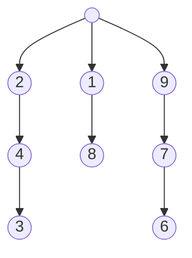

# Отчет по лабораторной работе №5-7

## Данные студента
- **ФИО:** Мазепа Илья Алексеевич
- **Группа:** М8О-209Б-23
- **Вариант:** 11
- **GitHub репозиторий:** [Ссылка на репозиторий](https://github.com/Tyhyqo/mai_oc)

## Тема

Распределенные системы и асинхронная обработка запросов

## Цель работы

Целью является приобретение практических навыков в:
- Управлении серверами сообщений (№5)
- Применении отложенных вычислений (№6)
- Интеграции программных систем друг с другом (№7)

## Задание

Реализовать распределенную систему по асинхронной обработке запросов. В данной распределенной системе должно существовать 2 вида узлов: **«управляющий»** и **«вычислительный»**. Необходимо объединить данные узлы в соответствии с той топологией, которая определена вариантом. Связь между узлами необходимо осуществить при помощи технологии очередей сообщений. Также в данной системе необходимо предусмотреть проверку доступности узлов в соответствии с вариантом. При убийстве (kill -9) любого вычислительного узла система должна пытаться максимально сохранять свою работоспособность, а именно все дочерние узлы убитого узла могут стать недоступными, но родительские узлы должны сохранить свою работоспособность.

Управляющий узел отвечает за ввод команд от пользователя и отправку этих команд на вычислительные узлы.

### Список основных поддерживаемых команд

#### Создание нового вычислительного узла

**Формат команды:** `create id [parent]`

- `id` – целочисленный идентификатор нового вычислительного узла
- `parent` – целочисленный идентификатор родительского узла. Если топологией не предусмотрено введение данного параметра, то его необходимо игнорировать (если его ввели)

**Формат вывода:**
- `«Ok: pid»`, где `pid` – идентификатор процесса для созданного вычислительного узла
- `«Error: Already exists»` - вычислительный узел с таким идентификатором уже существует
- `«Error: Parent not found»` - нет такого родительского узла с таким идентификатором
- `«Error: Parent is unavailable»` - родительский узел существует, но по каким-то причинам с ним не удается связаться
- `«Error: [Custom error]»` - любая другая обрабатываемая ошибка

**Пример:**
```sh
> create 10 5
Ok: 3128
```

#### Исполнение команды на вычислительном узле

**Формат команды:** `exec id [params]`
- id – целочисленный идентификатор вычислительного узла, на который отправляется команда

**Формат вывода:**
- `«Ok:id: [result]»`, где `result` – результат выполненной команды
- `«Error:id: Not found»` - вычислительный узел с таким идентификатором не найден
- `«Error:id: Node is unavailable»` - по каким-то причинам не удается связаться с вычислительным узлом
- `«Error:id: [Custom error]»` - любая другая обрабатываемая ошибка

**Пример:**
```sh
> exec 10 time
Ok:10: 0
> exec 10 start
Ok:10
> exec 10 start
Ok:10
*прошло 10 секунд*
> exec 10 time
Ok:10: 10000
*прошло 2 секунды*
> exec 10 stop
Ok:10
*прошло 2 секунды*
> exec 10 time
Ok:10: 12000
```
## Вариант

### Топология

Топология 1: Все вычислительные узлы находятся в списке. Есть только один управляющий узел. Чтобы добавить новый вычислительный узел к управляющему, то необходимо выполнить команду: `create id -1`



### Типы команд для вычислительных узлов

Набор команд 3 (локальный таймер)

**Формат команды сохранения значения:** `exec id subcommand`

- `subcommand` – одна из трех команд: `start`, `stop`, `time`.
  - `start` – запустить таймер
  - `stop` – остановить таймер
  - `time` – показать время локального таймера в миллисекундах

### Тип проверки доступности узлов

Команда проверки 1

**Формат команды:** `pingall`

Вывод всех недоступных узлов вывести разделенные через точку запятую.

**Пример:**
```sh
> pingall
Ok: -1 // Все узлы доступны
> pingall
Ok: 7;10;15 // узлы 7, 10, 15 — недоступны
```

### Технология очередей сообщений

ZeroMQ

## Реализация

### Управляющий узел

Управляющий узел отвечает за ввод команд от пользователя и отправку этих команд на вычислительные узлы. Он также обрабатывает создание новых узлов и проверку их доступности. При создании нового узла управляющий узел проверяет, существует ли уже узел с таким идентификатором, и если нет, создает новый процесс для вычислительного узла. Если родительский узел указан и доступен, новый узел добавляется в его список дочерних узлов.

### Вычислительный узел

Вычислительный узел выполняет команды, полученные от управляющего узла, такие как `start`, `stop` и `time` для управления локальным таймером. Он также отвечает на команды `ping` для проверки доступности. Вычислительный узел поддерживает асинхронную обработку команд, что позволяет выполнять несколько команд одновременно.

### Технология очередей сообщений

Для связи между узлами используется ZeroMQ, что обеспечивает асинхронную обработку запросов и высокую производительность. ZeroMQ позволяет легко масштабировать систему и добавлять новые узлы без необходимости изменения существующего кода.

### Обработка недоступных узлов

При убийстве процесса вычислительного узла (`kill -9`), управляющий узел получает сигнал о завершении дочернего процесса и помечает узел и все его дочерние узлы как недоступные. Это позволяет системе сохранять работоспособность родительских узлов и корректно обрабатывать команды `pingall` и `exec`.

## Анализ

### Управляющий узел

Управляющий узел отвечает за ввод команд от пользователя и отправку этих команд на вычислительные узлы. Он также обрабатывает создание новых узлов и проверку их доступности.

### Вычислительный узел

Вычислительный узел выполняет команды, полученные от управляющего узла, такие как `start`, `stop` и `time` для управления локальным таймером. Он также отвечает на команды `ping` для проверки доступности.

### Технология очередей сообщений

Для связи между узлами используется ZeroMQ, что обеспечивает асинхронную обработку запросов и высокую производительность.

## Заключение

В данной лабораторной работе была реализована распределенная система с асинхронной обработкой запросов, состоящая из управляющего и вычислительных узлов. Система поддерживает создание новых узлов, выполнение команд на узлах и проверку их доступности. Использование ZeroMQ обеспечивает надежную и эффективную связь между узлами.