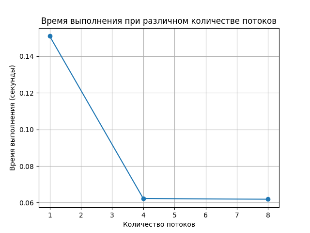
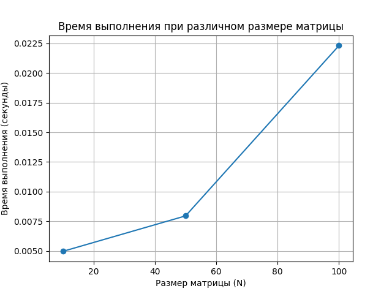
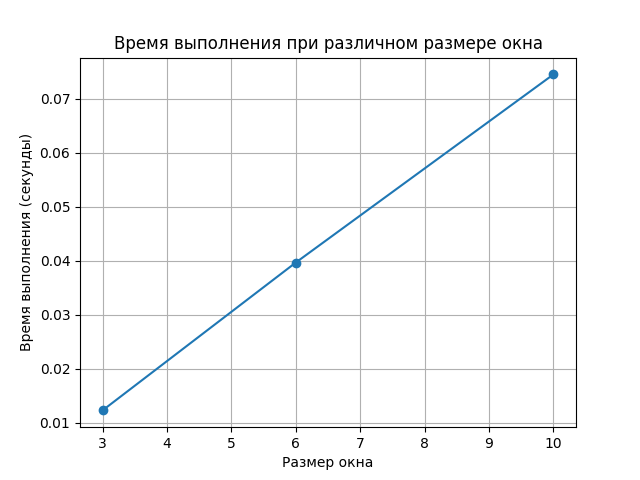

# Отчет по лабораторной работе №2

## Данные студента
- **ФИО:** Мазепа Илья Алексеевич
- **Группа:** М8О-209Б-23
- **Вариант:** 11
- **GitHub репозиторий:** [Ссылка на репозиторий](https://github.com/Tyhyqo/mai_oc)

## Цель работы
Целью является приобретение практических навыков в:
- Управлении потоками в ОС
- Обеспечении синхронизации между потоками

## Задание
Составить программу на языке Си, обрабатывающую данные в многопоточном режиме. При обработке использовать стандартные средства создания потоков операционной системы (Windows/Unix). Ограничение максимального количества потоков, работающих в один момент времени, должно быть задано ключом запуска вашей программы. Также необходимо уметь продемонстрировать количество потоков, используемое вашей программой с помощью стандартных средств операционной системы.

В отчете привести исследование зависимости ускорения и эффективности алгоритма от входных данных и количества потоков. Получившиеся результаты необходимо объяснить.

### Вариант
Наложить K раз медианный фильтр на матрицу, состоящую из целых чисел. Размер окна задается пользователем.

## Основные технологии и моменты

### Управление потоками
- Использование библиотеки `pthread` для создания и управления потоками.
- Создание потоков с помощью функции `pthread_create()`.
- Ожидание завершения потоков с помощью функции `pthread_join()`.

### Синхронизация между потоками
- Использование барьеров (`pthread_barrier_t`) для синхронизации потоков.
- Инициализация барьеров с помощью функции `pthread_barrier_init()`.
- Ожидание на барьере с помощью функции `pthread_barrier_wait()`.
- Уничтожение барьеров с помощью функции `pthread_barrier_destroy()`.

### Обработка системных ошибок
- Проверка ошибок при создании потоков и барьеров.
- Обработка ошибок при выделении памяти.

### Пример работы программы
1. Программа принимает количество потоков в качестве аргумента командной строки.
2. Пользователь вводит размер матрицы, количество повторений фильтра и размер окна.
3. Программа создает указанное количество потоков для наложения медианного фильтра на матрицу.
4. Каждый поток обрабатывает свою часть матрицы и синхронизируется с другими потоками через барьеры.
5. Программа выводит результат обработки и время выполнения.

### Исследование зависимости ускорения и эффективности алгоритма
Для исследования зависимости ускорения и эффективности алгоритма от входных данных и количества потоков были проведены следующие эксперименты:

1. **Измерение времени выполнения программы при различном количестве потоков:**
   - Время выполнения программы уменьшалось с увеличением количества потоков до определенного предела, после которого дальнейшее увеличение количества потоков не приводило к значительному улучшению производительности.
   - Это связано с накладными расходами на создание и управление потоками, а также с ограничениями на параллелизм, накладываемыми архитектурой процессора.

### Измерение времени выполнения программы при различном количестве потоков
- **Размер матрицы (N):** 100
- **Повторение фильтра (K):** 5
- **Размер окна:** 5

| Количество потоков | Время выполнения (секунды) |
|--------------------|-----------------------------|
| 1                  | 0.151009                    |
| 4                  | 0.062256                    |
| 8                  | 0.061879                    |

2. **Измерение времени выполнения программы при различном размере матрицы:**
   - Время выполнения программы увеличивалось с увеличением размера матрицы, так как увеличивалось количество данных для обработки.
   - Ускорение алгоритма было более заметным при больших размерах матрицы, так как большее количество данных позволяло более эффективно использовать параллелизм.

### Измерение времени выполнения программы при различном размере матрицы
- **Потоки:** 4
- **Повторение фильтра (K):** 3
- **Размер окна:** 3

| Размер матрицы (N) | Время выполнения (секунды) |
|--------------------|-----------------------------|
| 10                 | 0.004964                    |
| 50                 | 0.007954                    |
| 100                | 0.022311                    |

3. **Измерение времени выполнения программы при различном размере окна:**
   - Время выполнения программы увеличивалось с увеличением размера окна, так как увеличивалось количество элементов, которые необходимо обрабатывать для каждого элемента матрицы.
   - Ускорение алгоритма было менее заметным при больших размерах окна, так как увеличивались накладные расходы на сортировку элементов окна.

### Измерение времени выполнения программы при различном размере окна
- **Потоки:** 4
- **Размер матрицы (N):** 50
- **Повторение фильтра (K):** 5

| Размер окна | Время выполнения (секунды) |
|-------------|-----------------------------|
| 3           | 0.012318                    |
| 6           | 0.039672                    |
| 10          | 0.074484                    |

**Важно понимать, что таблица заполняется случайно сгенерированными числами. Размер таблицы NxN, размер окна также NxN (например, при размере окна 3 это 3x3, при размере окна 6 это 6x6).**

## Вывод
В результате выполнения лабораторной работы были приобретены практические навыки в управлении потоками в ОС и обеспечении синхронизации между потоками. Программа успешно создает потоки для наложения медианного фильтра на матрицу и синхронизирует их работу с помощью барьеров. Были проведены эксперименты по исследованию зависимости ускорения и эффективности алгоритма от входных данных и количества потоков, результаты которых были объяснены.